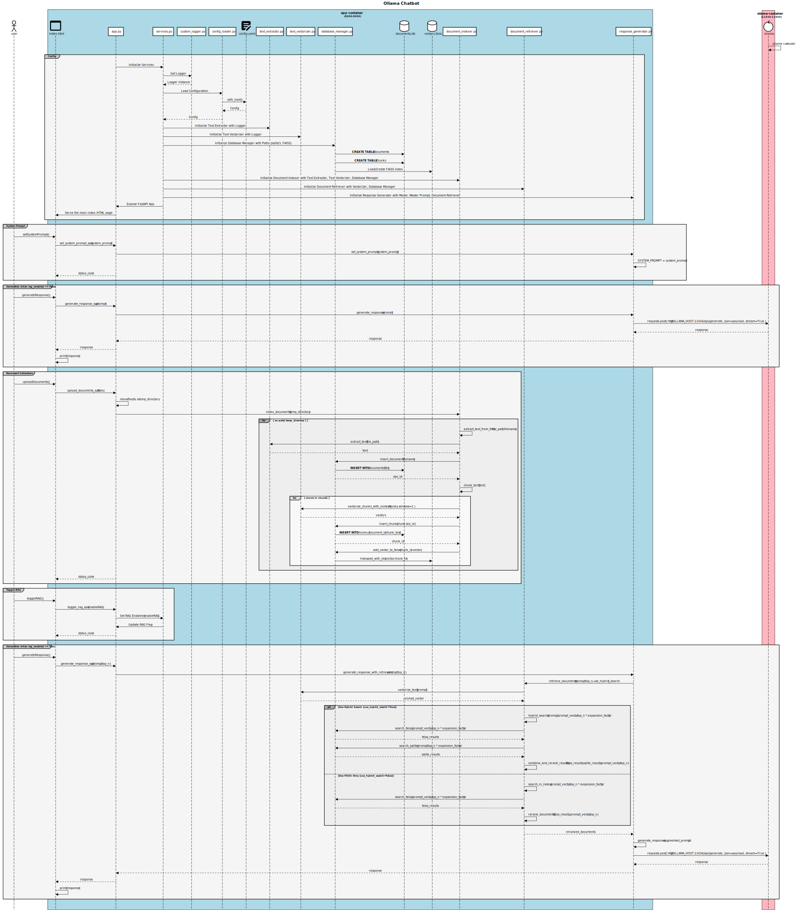

# Ollama Chatbot

## Table of Contents

1. [Project Overview](#project-overview)
2. [Sequence Diagram](#sequence-diagram)
3. [Prerequisites](#prerequisites)
4. [Installing Podman and Podman-Compose](#installing-podman-and-podman-compose)
5. [Configuration](#configuration)
6. [Run the Assistant](#run-the-assistant)
7. [Features](#features)
8. [Enhanced Retrieval Mechanisms](#enhanced-retrieval-mechanisms)
9. [Licenses](#licenses)
10. [Contributing](#contributing)
11. [Contact](#contact)

## Project Overview

The Ollama Chatbot is an **AI-based chatbot** that utilizes the `llama3.2:3B` model or alternative models. It can incorporate **Retrieval-Augmented Generation** to deliver enhanced automated responses when desired. The project is managed through **Podman** containers, allowing for efficient and scalable deployment.

## Sequence Diagram



## Prerequisites

| Package | Version |
| --- | --- |
| podman | 5.1.2 or greater |
| podman-compose | 1.2.0 or greater |

## Installing Podman and Podman-Compose

### Install Podman

**1. On Linux:**

- For Debian/Ubuntu-based distributions:
    ```bash
    sudo apt update
    sudo apt install podman -y
    ```

- For Fedora:
    ```bash
    sudo dnf install podman -y
    ```

- For Arch Linux:
    ```bash
    sudo pacman -S podman
    ```

**2. On macOS:**

- Install Podman using Homebrew:
    ```bash
    brew install podman
    ```

- Initialize the Podman environment (if not already done):
    ```
    podman machine init
    podman machine start
    ```

**3. On Windows:**

- Download the installer from the official [Podman website](https://podman-desktop.io/docs/installation/windows-install).
- Follow the installation instructions provided for Windows.

### Install Podman-Compose

Ensure you have Python installed on your system.

- Install Podman-Compose with pip:
    ```bash
    pip install podman-compose
    ```

- Verify the installation:
    ```bash
    podman-compose --version
    ```

## Configuration

**Model:** Specify the model you want to use by modifying the *model* variable in `src/resources/config.yaml`. `llama3.2:3B` is set as the default model. To see the list of available models, visit https://ollama.com/library.

## Run the assistant

To interact with the chatbot, follow these steps:

1. Navigate to the `scripts/` directory
    ```
    cd scripts/
    ```

3. Start the ollama container using the script `ollama.bat` on Windows, or the script `ollama.sh` on macOS/Linux
    ```
    ollama.bat start
    ```
    ```
    ollama.sh start
    ```

    **NOTE:** To use a model other than llama3.2, specify the model name as the second parameter. For example, to use the `granite-code` model, run `ollama.bat start granite-code` on Windows or `ollama.sh start granite-code`  on macOS/Linux.

4. Start the app container once the Ollama container is up and running. Use the script `app.bat` on Windows, or the script `app.sh` on macOS/Linux
    ```
    app.bat start
    ```
    ```
    app.sh start
    ```

5. Once the app container is running and the Uvicorn server is started, open your browser and go to http://localhost:8000/ to chat with the assistant. 

## Features

1. **Customizable System Prompt**
    * Define a System Prompt to customize the assistant's behavior and response style to fit your needs.

2. **Document Collections & Retrieval-Augmented Generation (RAG)**
    * RAG enhances the assistant’s responses by combining its knowledge with user-uploaded documents. 
    * You can upload documents directly through the "Upload Documents" option on the left panel, supporting various formats including `DOCX`, `PPTX`, `PDF`, `TXT`, `XLSX`, `CSV`, `HTML`, `Markdown`, `RTF`, and `ODT`.
    * Use the "Clean Document Collections" button to delete previously uploaded files, keeping your document set relevant and current. Please note that this action will remove **ALL** previously uploaded documents.
    * With RAG, you can also choose the number of document chunks to retrieve for each prompt, ranging from 1 to 10. This allows the assistant to provide more contextually relevant answers by leveraging the content from your uploaded documents.

## Enhanced Retrieval Mechanisms

In addition to the standard Retrieval-Augmented Generation (RAG) mechanism, the Ollama Chatbot incorporates advanced techniques for improving document retrieval and response relevance:

### 1. Chunk Vectorization with Context

While traditional RAG may rely on isolated chunks of text, this project enhances the vectorization process by considering the context of each chunk. The text chunks are vectorized in a manner that takes into account neighboring chunks, creating a more contextually aware representation.

**How It Works:**
- Chunks are vectorized by including neighboring chunks within a specified window (default is 1). This ensures that the context around each chunk is captured, improving the quality of responses.
- For each chunk, we apply dynamic weighting based on the similarity to adjacent chunks. This weighting adjusts the influence of the neighboring chunks, allowing the model to emphasize the most relevant context.

### 2. Hybrid Search (Vector + Lexical Search)

To further improve document retrieval accuracy, a hybrid search approach combines vector-based search using FAISS with lexical search through SQL-based keyword matching. This combination ensures a more comprehensive search, capturing both semantic and keyword-based relevance.

**How It Works:**
- **FAISS Search:** The query is transformed into a vector, which is then used to find the most similar documents in the database through FAISS, based on vector distance.
- **SQLite Search:** Simultaneously, keywords are extracted from the query using tokenization, stopword removal, and part-of-speech tagging, ensuring that only significant words (like nouns or proper nouns) are selected for the lexical search. These extracted keywords are then used to find matching documents in the SQLite database.
- **Combination of Results:** The results from both searches are merged, with FAISS results receiving a higher weight due to their semantic relevance, while lexical results contribute at a lower weight, offering a balanced retrieval that enhances the accuracy of document selection.

This hybrid search approach significantly improves the ability to retrieve relevant documents, particularly in cases where certain keywords may not be well-represented in the vector space.

### 3. Reranking of Retrieved Documents

To refine the quality of the retrieved documents, a reranking mechanism is applied. This process ensures that the most relevant documents are selected and presented based on their similarity to the query.

**How It Works:**
- The retrieved documents are first ranked based on their similarity to the prompt using cosine similarity.
- Then, a reranking process is applied to reorder the documents, ensuring that the most relevant ones are selected.
- The number of documents returned is controlled, allowing fine-tuned responses by limiting the results to the top-n most relevant documents.

These additional mechanisms enhance the quality of document retrieval and ensure that the chatbot provides responses that are more accurate and contextually relevant.

## Licenses

The Ollama Chatbot project uses several third-party Python libraries, each distributed under its respective license. The complete list of dependencies and their licenses is provided in [LICENSES.md](LICENSES.md).
